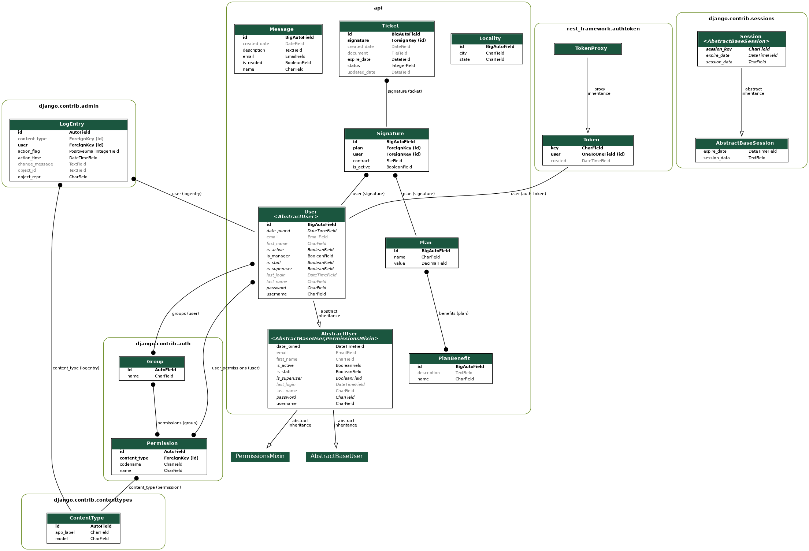

# VeloxNet - Backend

Api da VeloxNet baseada em Django Rest Framework.

## Como Rodar a Aplicação

Siga estas instruções para configurar e executar a aplicação localmente.

### Pré-requisitos

- Python 3.9+ instalado
- Ambiente virtual Python (opcional, mas recomendado)

### Instalação do Python

Siga um dos guias abaixo de acordo ao seu sistema operacional:
- [**Linux**](https://docs.python.org/3/using/unix.html)
- [**Windows**](https://docs.python.org/3/using/windows.html)
- [**MacOS**](https://docs.python.org/3/using/mac.html)

### Configuração do Ambiente Virtual Python (Opcional)

```bash
# Instalação do virtualenv (caso ainda não tenha)
pip install virtualenv

# Criação de um ambiente virtual
virtualenv venv

# Ativação do ambiente virtual
# Linux/macOS
source venv/bin/activate
# Windows
venv\Scripts\activate
```

### Instalação das Dependências

```bash
cd backend
pip install -r requirements.txt
```

### Executando a Aplicação

```bash
python manage.py migrate  # Aplica as migrações do banco de dados
python manage.py runserver  # Inicia o servidor de desenvolvimento
```

Agora você pode acessar os endpoints em [http://localhost:8000/](http://localhost:8000/).

## Referências

- Python: [Documentação oficial do Python](https://docs.python.org/3/)
- Django: [Documentação oficial do Django](https://docs.djangoproject.com/)
- Django Rest Framework (DRF): [Documentação oficial do Django Rest Framework](https://www.django-rest-framework.org/)

## Endpoints da API

No arquivo [api.rest](../test_utils/api.rest), que pode ser usado no VSCode com o auxílio da extensão [REST Client](https://marketplace.visualstudio.com/items?itemName=humao.rest-client), são listados os endpoints e seus respectivos cabeçalhos e corpo da requisição. Nos endpoints privados com controle de acesso que requerem autenticação e/ou privilégios de administrador, é possível notar o cabeçalho `Authorization: Token {{authorization}}`, onde `{{authorization}}` será substituído pelo token recebido na resposta da chamada ao endpoint de login, que no mesmo arquivo pode ser configurado na variável `@authorization` que fica logo no topo. Mais detalhes sobre os endpoints podem ser conferidos diretamente no arquivo em questão.

## Banco de Dados

Segue o seguinte diagrama de classes:


Esquema gerado com a biblioteca [django-extensions](https://github.com/django-extensions/django-extensions):

```
python3 manage.py graph_models --pygraphviz -a -g -o diagrama.png
```

## Tutoriais Seguidos

- [Como fazer deploy de uma aplicação Django na Vercel](https://www.youtube.com/watch?v=I5x8lAVQ8QQ)
- [Como servir arquivos estáticos e mídia na AWS S3 para o Django](https://testdriven.io/blog/storing-django-static-and-media-files-on-amazon-s3/)
- [Como gerar diagrama de classes do projeto django](https://ohmycode.com.br/gerando-o-diagrama-de-classes-do-seu-projeto-django/)
